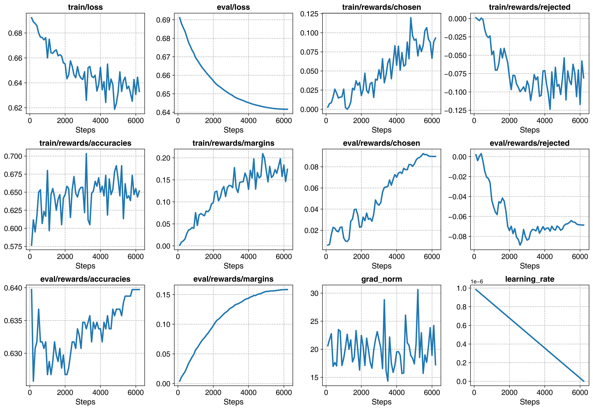

# Qwen2.5-0.5B SFT+DPO

This project uses huggingface's `trl` library for Supervised Fine-Tuning (SFT) and Direct Preference Optimization (DPO) of the `Qwen2.5-0.5B` pre-trained checkpoint. Both SFT and DPO use the `LoRA` method provided by the `PEFT` library. Finally, a multi-round dialog website was built using `Gradio`.

## 1 DEMO
This is a demonstration video of a multi round dialogue website built using weights trained with SFT and DPO.

<video src="https://github.com/FugueZ/Qwen2.5-0.5B-SFT-DPO/blob/main/ref/demonstration.gif" controls width="100%"></video>


## 2 Requirements

```
trl==0.15.2
peft==0.11.1
gradio==5.7.1
datasets==3.3.2
transformers==4.49.0
```

The python version is 3.11.5. The GPU is Tesla V100-DGXS-32GB*4

## 3 Supervised Fine-Tuning

- Use Lora's fine-tuning method
- The train dataset is `trl-lib/Capybara` which can be found in huggingface
- epoch=3
- learning_rate=1e-5
- weight_decay=0.001
- max_grad_norm=0.3
- warmup_ratio=0.03
- lr_scheduler_type=cosine


## 4 Direct Preference Optimization

- Use Lora's fine-tuning method
- The train dataset is `trl-lib/ultrafeedback_binarized` which can be found in huggingface
- epochs=3
- learning_rate=1e-6
- weight_decay=0.001
- max_grad_norm=1
- lr_scheduler_type=linear



### 5 Build a Multi-Round Dialogue Website

- Load the weights of Qwen2.5-0.5B after SFT and DPO
- Define the response function for multiple rounds of dialogue
- The multi round dialogue website is shown in the [GIF](#1-demo)